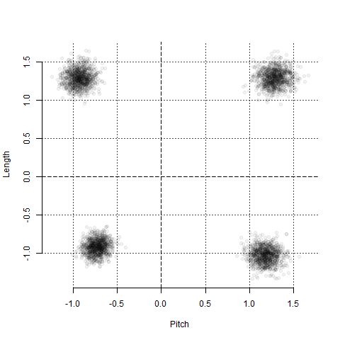
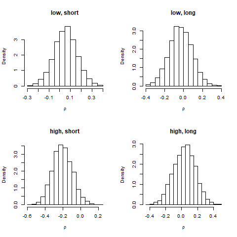
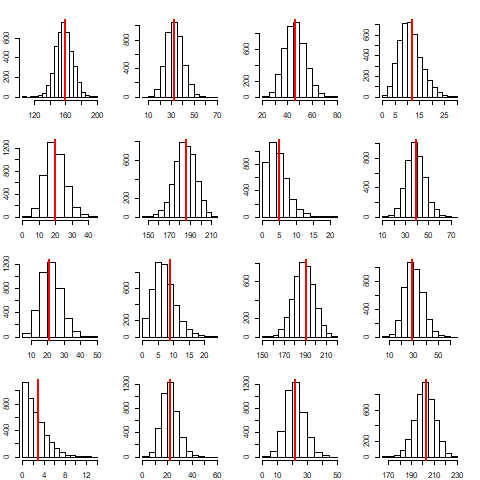

# Analysis of data set silbert09a from the package mdsdt

Check out the R file for details on how this analysis was carried out.

The results are described here graphically. 

## One rho

Posterior distributions for the means of the latent distributions:

Posterior distribution for the (shared) correlation coefficient of the latent distributions:
 correlation coefficient of the latent distributions")

## Four rhos

Posterior distributions for the means of the latent distributions:

Posterior distributions for the correlation coefficients of the latent distributions:

## Discussion

There doesn't seem to be evidence of interactions between the means of the latent distributions in either of the models. At least anything that could be distinguished among the remaining uncertainty about the mus. 

The posterior distributions for the correlation coefficients are faily wide, indicating lack of strong evidence to way or the other.

In the model with four rhos the posterior distribution for the stimulus "high, short" seems to be slightly tilted towards negative values, suggesting that there might be a negative correlation between these responses. However, the evidence is not strong enough to make decisive inferences.

## Posterior predictive distribution

An important part of Bayesian workflow is the critisism of the models used. The boxian heuristic that "all models are wrong" is a good starting point. We know with absolute certainty that our model is wrong, it's an abstraction of categorization, and we should be as aware as possible of the ways in which the model fails. 

In Bayesian statistics one particularly useful way of approaching this is throug posterior predicive checks. This means in practice that we generate simulated data based on the posterior distribution and compare that with the observed data. The idea is that the generated data is a representation of how the model "sees" the world. If there's a mismatch between predicted and observed data, this implies that the model doesn't sufficiently describe the data generating process. 

There are may ways of generating a posterior predictive distribution. One can use many quantities of the data as the test statistic. Here, functions are provided for generating the distribution. The plotting functions simply plot the simulated respose frequencies against oberved frequencis. You should be aware that this is not necessarily the best possible way; there might be problems that can not be revealed in this way.

Model with one rho:

Model with four rhos:

Generally, both models seem to replicate the data fairly well. In some categories, for example for stimulus (row) "high, long" the model seems to predict slightly less "low, short" responses, but I think even in that case it is correct on average. 
